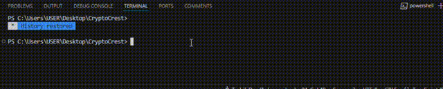
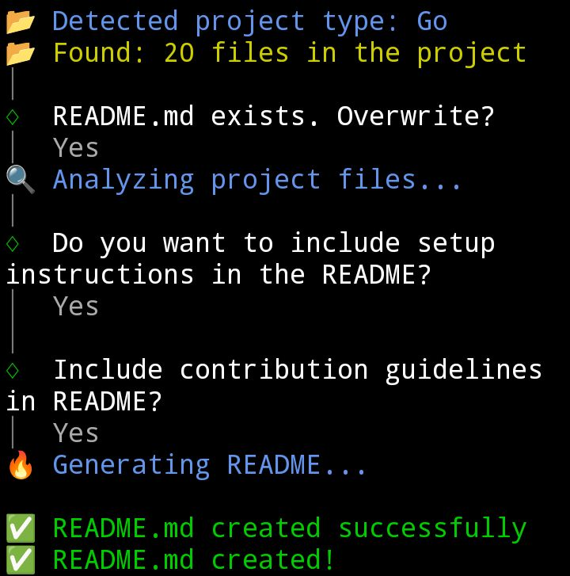
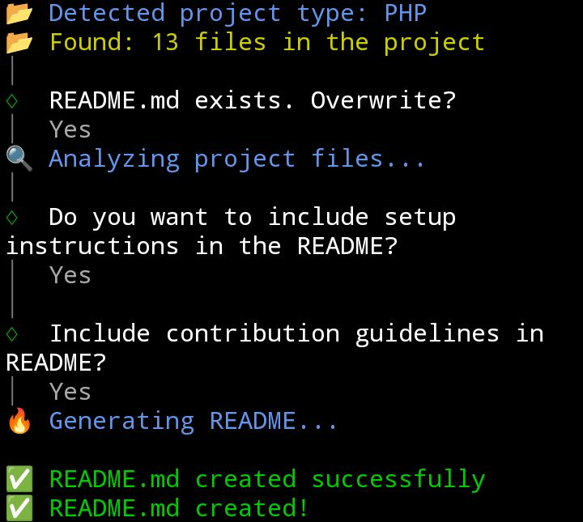
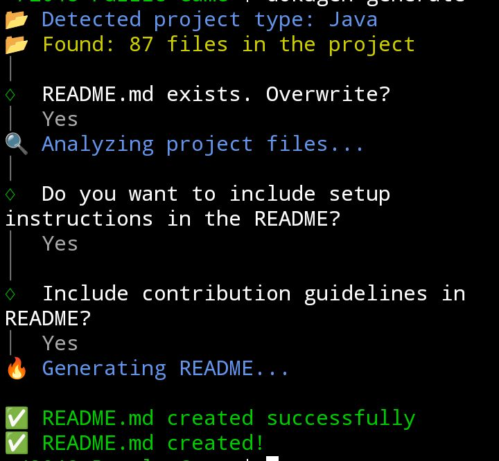
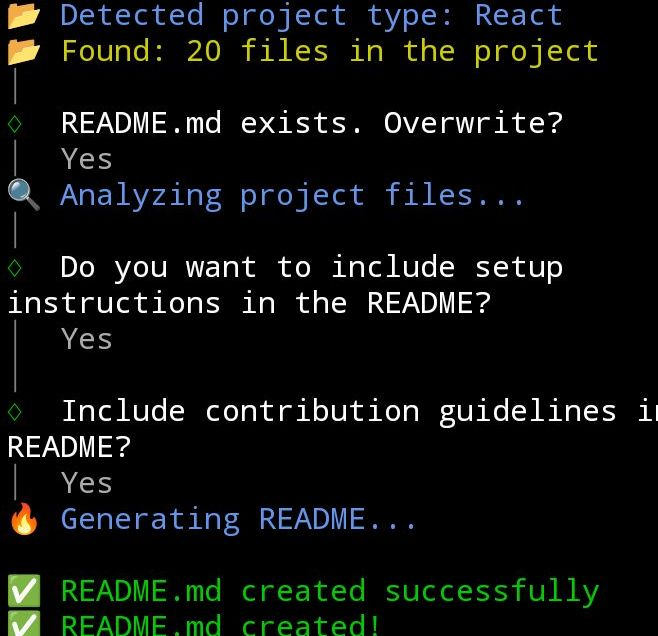
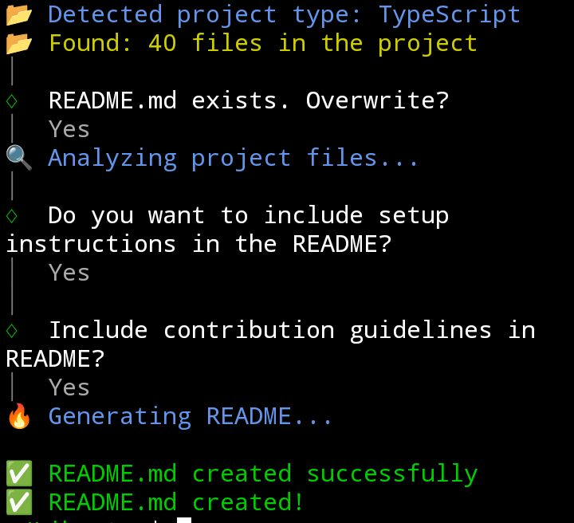
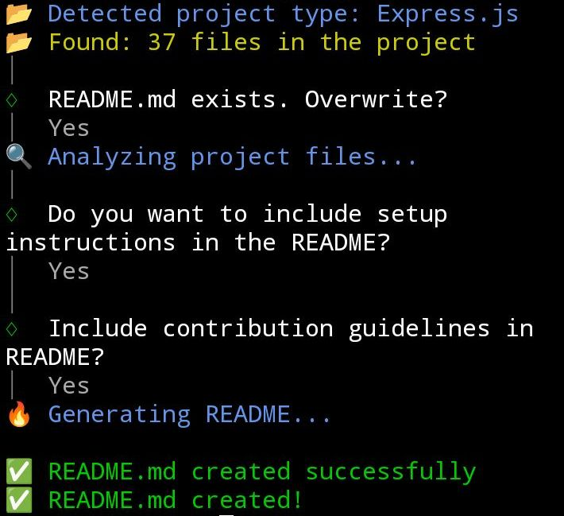
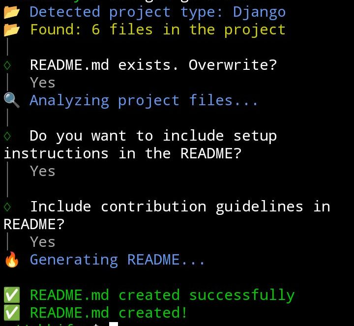

# Dokugen 


Dokugen is lightweight README.md file Generator Command Line Interface Tool. It simplifies the process of writing your README.md file from scratch by generate professional README.md files for your projects, saving you time and ensuring consistency using AI.

## Usage

### Install Dokugen globally! (Recommended)

```bash
npm install -g dokugen
```

### Generate a new README interactively

```bash
dokugen generate 
```

> This command launches an interactive prompt to guide you through creating a professional README file.

---

### Generate README with template

```bash
dokugen --template https://raw.githubusercontent.com/username/repo-name/blob/main/README.md
```

> use a custom GitHub repo readme file as a template to generate a concise and strict readme for your project.

---

### Check Version 

```bash
dokugen --version
```

> Displays Current Version (3.4.0)


## Features

-   **Automated Generation**: Automatically analyzes your project and generates a comprehensive README.
-   **Easy to Use**: Simple command-line interface for quick and easy README creation.
-   **Cross-Platform**: Works seamlessly on Windows, macOS, and Linux.
-   **Programming Language and Framework Agnostic**: Works seamlessly any language e.g python, JavaScript, go, c#, c, rust e.t.c
-   **Options & Flags**: Support flags and options like generate from a template, overwrite e.t.c

### Progrmamming Language & Framework Agnostic compatible mostly all languages. Some examples are:

### Golang


### Php


### Java


### React 


### Typescript 


### Express.Js


### Python Django 


##  Technologies Used

| Technology  | Description                                        | Link                                                           |
| :---------- | :------------------------------------------------- | :------------------------------------------------------------- |
| Node.js     | JavaScript runtime environment                     | [https://nodejs.org/](https://nodejs.org/)                     |
| TypeScript  | Typed superset of JavaScript                       | [https://www.typescriptlang.org/](https://www.typescriptlang.org/) |
| Commander.js | Node.js command-line interfaces                   | [https://github.com/tj/commander.js](https://github.com/tj/commander.js) |
| Inquirer.js | Interactive command line prompt toolkit           | [https://github.com/SBoudrias/Inquirer.js](https://github.com/SBoudrias/Inquirer.js) |
| Axios | Promise based HTTP client for the browser and node.js | [https://github.com/axios/axios](https://github.com/axios/axios) |
| Chalk | Terminal string styling done right | [https://github.com/chalk/chalk](https://github.com/chalk/chalk) |
| Esbuild | An extremely fast JavaScript bundler and minifier | [https://github.com/evanw/esbuild](https://github.com/evanw/esbuild) |

## License

This project is licensed under the MIT License - see the [LICENSE](LICENSE) file for details.

## Contributing 

Contributions are welcome but first and mostly open an issue with your feature request! [Read the guide here.](https://github.com/samueltuoyo15/Dokugen/blob/main/CONTRIBUTION.md)
## Author Info

-   **OritseWeyinmi Samuel Tuoyo** 
  - [Twitter](https://x.com/TuoyoS26091)
  - [LinkedIn](https://www.linkedin.com/in/samuel-tuoyo-8568b62b6)

##  Badges

[](https://opensource.org/licenses/MIT)
[](https://opensource.org/)
[](https://GitHub.com/Naereen/StrapDown.js/graphs/commit-activity)

[](https://www.npmjs.com/package/dokugen)
