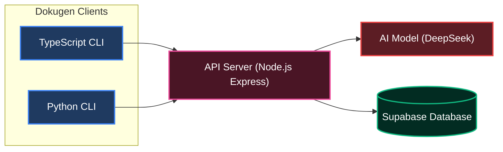

# Dokugen: The Smart README Generator


## Overview

Dokugen is a helpful tool that automatically creates and updates README files for your projects. It takes a look at your codebase, figures out what your project does, and then writes a clear, detailed README so you don't have to spend time doing it yourself. It's built to make sure your project always has professional and accurate documentation.

## System Architecture / Design

Dokugen uses a client-server architecture. CLI clients (Python, TypeScript) interact with a backend API server, which then communicates with DeepSeek AI for README generation and Git commit message creation. User profile data is stored securely in a Supabase database.


```mermaid
flowchart LR
  subgraph Clients["Dokugen Clients"]
    TSCLI["TypeScript CLI"]
    PythonCLI["Python CLI"]
  end

  API["API Server (Node.js Express)"]
  AI["AI Model (DeepSeek)"]
  DB[("Supabase Database")]

  TSCLI --> API
  PythonCLI --> API
  API --> AI
  API --> DB

  style TSCLI fill:#1f3a60,stroke:#3b82f6,stroke-width:2px,color:#fff
  style PythonCLI fill:#1f3a60,stroke:#3b82f6,stroke-width:2px,color:#fff
  style API fill:#4a1525,stroke:#ec4899,stroke-width:2px,color:#fff
  style AI fill:#5c1d24,stroke:#ef4444,stroke-width:2px,color:#fff
  style DB fill:#022c22,stroke:#10b981,stroke-width:2px,color:#fff
```

## Features

*   **Interactive Menu**: Run `dokugen` with no arguments to navigate all tool actions through a console prompt, making it easy to use for new and experienced developers.

    ```mermaid
    sequenceDiagram
      actor User
      participant CLI as "Dokugen CLI"
      User->>CLI: Run "dokugen"
      CLI->>CLI: Display interactive options
      CLI->>User: Select action (Generate, Update, Commit)
      User->>CLI: Choose an action
      CLI->>CLI: Execute selected command
    ```

*   **Smart Updates**: Re-run the generation process without losing your manual modifications. Only auto-generated blocks get updated, ensuring your personalized content remains.

    ```mermaid
    sequenceDiagram
      actor User
      participant CLI as "Dokugen CLI"
      participant API as "API Server"
      participant AI as "AI Model"
      User->>CLI: Run "dokugen update"
      CLI->>API: Send project data + existing README
      API->>AI: Analyze code and README
      AI->>API: Return updated README sections
      API->>CLI: Send updated content
      CLI->>User: Write merged README.md
    ```

*   **AI-Powered Commits**: Automatically stages changes and generates conventional commit messages using AI, based on your staged files. This helps maintain a consistent and clear commit history.

    ```mermaid
    sequenceDiagram
      actor User
      participant CLI as "Dokugen CLI"
      participant Git as "Local Git"
      participant API as "API Server"
      participant AI as "AI Model"
      User->>CLI: Run "dokugen aic"
      CLI->>Git: Get staged changes (diff)
      CLI->>API: Send diff for analysis
      API->>AI: Request commit message
      AI->>API: Return generated message
      API->>CLI: Send commit message
      CLI->>User: Confirm / Edit message
      User->>CLI: Accept message
      CLI->>Git: Commit changes
    ```

*   **Compressed Uploads**: Efficiently packages codebases with 70–90% upload size compression to support analyzing larger projects without hitting API size limits.

*   **Language & Framework Agnostic**: Works out of the box with any programming language or framework (JavaScript, TypeScript, Python, Rust, Go, Java, PHP, C++, Django, React, etc.). You don't need Node.js or Python to be the main language of your codebase; simply install the Dokugen CLI globally using Node (`npm`/`pnpm`/`yarn`) or Python (`pip`/`uv`) on your system, and run it in any project folder.

## Installation

This project is a monorepo. Here's how to get it running:

### Prerequisites

*   **Node.js**: Version 18 or higher
*   **pnpm**: Recommended package manager (you can also use `npm` or `yarn`)
*   **Python 3.8+**: For the Python CLI client
*   **Go 1.24+**: For the Go CLI client

### Global Setup

1.  **Clone the Repository**:
    ```bash
    git clone https://github.com/samueltuoyo15/Dokugen.git
    ```

2.  **Navigate to the Project Root**:
    ```bash
    cd Dokugen
    ```

3.  **Install All Dependencies**:
    We use a workspace structure with pnpm, so installing at the root handles dependencies for all apps (CLI, Server) at once.
    ```bash
    pnpm install
    # or
    npm install
    # or
    yarn install
    ```

### Or Download Standalone Binary (No Node.js/Python Required)

> **Experimental:** Standalone binaries are currently experimental and unstable. If you run into issues, please use the Node.js or Python packages instead.

- [Windows x64](https://github.com/samueltuoyo15/Dokugen/releases/download/v3.11.0/dokugen-windows-x64.exe)
- [macOS Silicon](https://github.com/samueltuoyo15/Dokugen/releases/download/v3.11.0/dokugen-macos-arm64)
- [macOS Intel](https://github.com/samueltuoyo15/Dokugen/releases/download/v3.11.0/dokugen-macos-x64)
- [Linux x64](https://github.com/samueltuoyo15/Dokugen/releases/download/v3.11.0/dokugen-linux-x64)

---

### Setting up the Server

The server requires environment variables to run.

1.  **Navigate to the Server Directory**:
    ```bash
    cd apps/server
    ```

2.  **Create a `.env` file**:
    Create a `.env` file in the `apps/server/` directory and add the following variables. Replace placeholders with your actual keys and URLs.

    ```env
    PORT=3000
    NODE_ENV=development
    BACKEND_DOMAIN=http://localhost:3000
    DEEPSEEK_API_KEY=your_deepseek_api_key_here
    README_MODEL_NAME=deepseek-v4-pro
    COMMIT_MODEL_NAME=deepseek-v4-flash
    SUPABASE_CLIENT_URL=your_supabase_url
    SUPABASE_PUBLISHABLE_KEY=your_supabase_publishable_key
    SUPABASE_SECRET_KEY=your_supabase_secret_key
    ```

3.  **Build and Run the Server**:
    ```bash
    pnpm run build
    pnpm start
    ```
    For development, you can use `pnpm run dev`.

### Setting up the Python CLI Client

1.  **Navigate to the Python CLI Directory**:
    ```bash
    cd apps/cli/clients/python
    ```

2.  **Set Up a Virtual Environment**:
    It's recommended to use a Python virtual environment to manage dependencies.
    ```bash
    python -m venv .venv
    # Activate virtual environment
    # On Windows:
    .venv\Scripts\activate
    # On macOS/Linux:
    source .venv/bin/activate
    ```

3.  **Install in Editable Mode**:
    Install the package and its development dependencies.
    ```bash
    pip install -e .
    ```

### Setting up the TypeScript CLI Client

1.  **Navigate to the TypeScript CLI Directory**:
    ```bash
    cd apps/cli/clients/typescript
    ```

2.  **Build the Project**:
    Compile the TypeScript code.
    ```bash
    pnpm run build
    ```

3.  **Install Globally**:
    ```bash
    pnpm install -g .
    # or link it for development
    pnpm link --global
    ```

## Usage

Dokugen offers an interactive assistant and standalone commands to manage your README files and Git commits.

### Interactive Assistant

Simply run `dokugen` in your project folder to open the interactive setup assistant. From here, you can generate a README, update files, revert backups, or run AI-assisted Git commits.

```bash
dokugen
```

### Standalone Commands

#### Generate README

Scan your project files and create a new `README.md`.
```bash
dokugen generate
```

To generate a README using a custom template from a public GitHub repository, like this:
```bash
dokugen generate --template https://raw.githubusercontent.com/username/repo/main/README.md
```

#### Smart Update README

Intelligently rebuilds auto-generated sections (like the tech stack, API details, and file layout) while keeping your custom text, notes, and badges intact.
```bash
dokugen update
```

#### AI Git Commit (`aic`)

Analyze your staged files, automatically generate a Conventional Commit message, commit, and optionally push.
```bash
dokugen aic
```

You can also push immediately after committing:
```bash
dokugen aic --push
```

#### Safety Backup Revert (`revert`)

Accidentally generated something you didn't like? Restore your previous README instantly from our automatic backup.
```bash
dokugen revert
```

## Technologies Used

| Category   | Technology                                                                                                                                              |
| :--------- | :------------------------------------------------------------------------------------------------------------------------------------------------------ |
| **Monorepo** | [Turborepo](https://turbo.build/)                                                                                                                       |
| **Backend**  | [TypeScript](https://www.typescriptlang.org/), [Node.js](https://nodejs.org/), [Express.js](https://expressjs.com/), [Supabase](https://supabase.com/) |
| **AI**       | [DeepSeek](https://www.deepseek.com/)                                                                                                                   |
| **Client**   | [TypeScript](https://www.typescriptlang.org/), [Python](https://www.python.org/), [Go](https://go.dev/)                                                 |
| **Frontend** | [React](https://react.dev/), [Next.js](https://nextjs.org/) (likely in future plans or for a web dashboard)                                              |
| **Dev Tools**| [pnpm](https://pnpm.io/)                                                                                                                                |

## Contributing

We welcome contributions to Dokugen! If you're looking to help out, please check out our [Contribution Guide](https://github.com/samueltuoyo15/Dokugen/blob/main/CONTRIBUTION.md) to get started. It'll walk you through setting up the project and contributing effectively.

## License

This project is licensed under the MIT License. See the [LICENSE](https://github.com/samueltuoyo15/Dokugen/blob/main/LICENSE) file for details.

## Author Info

*   **Samuel Tuoyo**
*   [LinkedIn](https://linkedin.com/in/samuel-tuoyo)
*   [X (Twitter)](https://x.com/TuoyoS26091)

---

## Badges

[](https://opensource.org/licenses/MIT)
[](https://opensource.org/)
[](https://GitHub.com/Naereen/StrapDown.js/graphs/commit-activity)
[](https://www.typescriptlang.org/)
[](https://nodejs.org/)
[](https://expressjs.com/)
[](https://react.dev/)
[](https://nextjs.org/)
[](https://www.python.org/)
[](https://go.dev/)
[](https://supabase.com/)
[](https://www.deepseek.com/)
[](https://turbo.build/)
[](https://pnpm.io/)
[](https://github.com/acekyd/made-in-nigeria)

[](https://dokugen.samueltuoyo.com)
