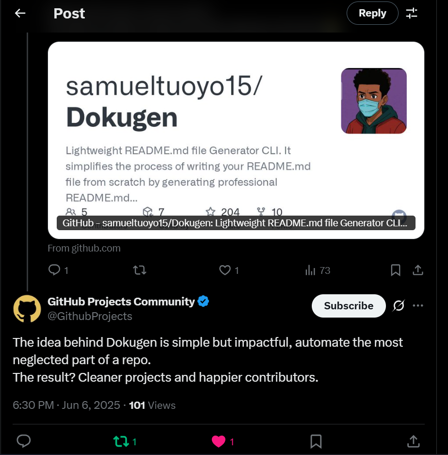

# Dokugen


Dokugen is a lightweight README.md file Generator Command Line Interface Tool. It simplifies the process of writing your README.md file from scratch by generating professional README.md files for your projects, saving you time and ensuring consistency using AI. The idea behind Dokugen is simple but impactful, automate the most neglected part of a repo. The results cleaner projects and happier contributors

## Usage

### Install Dokugen globally once, and use forever (Recommended)

#### Node.js
```bash
npm install -g dokugen
# or
yarn global add dokugen
# or
pnpm add -g dokugen
```

#### Python (Experimental - uv/pip)
```bash
# Recommended (using uv)
uv tool install dokugen

# Or using pip
pip install dokugen
```

### Or Download Standalone Binary (No Node.js/Python Required)

> [!WARNING]
> **Experimental Vibes:** These standalone binaries are super new and honestly pretty unstable. If you use them, you’ll probably run into issues, that’s just how it is right now. If it breaks, just stick to the Node.js and Python version for now.

## What's New

### Standalone Binaries (No Node.js Required)
You can now run Dokugen without installing Node.js! We've added standalone executables for Windows, macOS, and Linux.

### Intelligent Updates
The new `dokugen update` command intelligently updates only the auto-generated sections of your README while preserving your custom edits.

### Fixes & Improvements
- Improved auto-update mechanism reliability.
- Optimized performance for large codebases.

---

### Installation via Binary

**Windows**
[Download dokugen-windows-x64.exe](https://github.com/samueltuoyo15/Dokugen/releases/download/v3.11.0/dokugen-windows-x64.exe)

**macOS (Apple Silicon M1/M2/M3)**
[Download dokugen-macos-arm64](https://github.com/samueltuoyo15/Dokugen/releases/download/v3.11.0/dokugen-macos-arm64)

**macOS (Intel)**
[Download dokugen-macos-x64](https://github.com/samueltuoyo15/Dokugen/releases/download/v3.11.0/dokugen-macos-x64)

**Linux**
[Download dokugen-linux-x64](https://github.com/samueltuoyo15/Dokugen/releases/download/v3.11.0/dokugen-linux-x64)

### Navigate to the project you want to work with

```bash
cd my-project
```

### Generate a new README interactively

```bash
dokugen generate
```

> This command launches an interactive prompt to guide you through creating a professional README file.

---

### Generate README with template

```bash
dokugen generate --template https://raw.githubusercontent.com/username/repo-name/blob/main/README.md
```

> Use a custom GitHub repo readme file as a template to generate a concise and strict readme for your project.

---

### Update Existing README (Smart Update)

```bash
dokugen update
```

> **NEW!** Intelligently updates only auto-generated sections of your README while preserving all your custom content. Perfect for keeping your README fresh as your project evolves without losing your personal touch.

**What gets updated:**
- Tech stack and dependencies
- API documentation
- Installation instructions
- Features list

**What stays safe:**
- Your custom introductions
- Personal badges and links
- Custom examples
- Manual sections you've added

---

### Check Version

```bash
dokugen --version
```

> Displays Current Version (3.11.0)

## Features

- **Auto-Update System**: Dokugen automatically checks for new versions and updates itself when you run any command. Always stay current!
- **Smart README Updates**: Update your README without losing custom content. Only auto-generated sections get refreshed.
- **Automated Generation**: Automatically analyzes your project and generates a comprehensive README.
- **Real-Time Streaming**: Watch your README populate in real-time as it's being generated.
- **Compression Technology**: Handles large codebases efficiently with 70-90% payload size reduction.
- **Easy to Use**: Simple command-line interface for quick and easy README creation.
- **Cross-Platform**: Works seamlessly on Windows, macOS, and Linux.
- **Programming Language and Framework Agnostic**: Works with any language (e.g., Python, JavaScript, Go, C#, C, Rust, etc.)
- **Options & Flags**: Supports flags and options like generating from a template, overwriting existing files, etc.

### Programming Language & Framework Compatibility


### Review from Github Projects Community


             |
## License

This project is licensed under the MIT License - see the [LICENSE](LICENSE) file for details.

## Contributing

Contributions are welcome! [Read the contribution guide here.](https://github.com/samueltuoyo15/Dokugen/blob/main/CONTRIBUTION.md)

## Author

- **Samuel Tuoyo**
- [Twitter](https://x.com/TuoyoS26091)
- [LinkedIn](https://www.linkedin.com/in/samuel-tuoyo-8568b62b6)

## Badges

[](https://opensource.org/licenses/MIT)
[](https://opensource.org/)
[](https://GitHub.com/Naereen/StrapDown.js/graphs/commit-activity)
[](https://www.npmjs.com/package/dokugen)
[](https://github.com/acekyd/made-in-nigeria)
