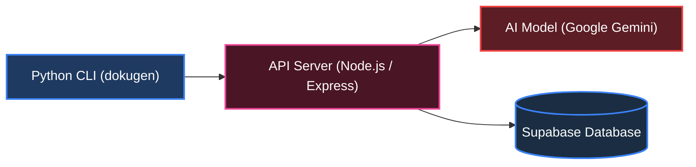

# Dokugen (Python Client)


[](https://myhappr.xyz/samueltuoyo)

Dokugen is a lightweight, AI-powered CLI tool that automatically generates and maintains `README.md` files and `LICENSE` files for your projects. It scans your codebase, understands what your project does, and produces clean, professional documentation — so you don't have to.

---

## Quick Start

### Installation

Install Dokugen globally using `uv` (recommended) or `pip`:

```bash
uv tool install dokugen
# or
pip install dokugen
```

---

## Usage

### 1. Launch the Interactive Assistant

Simply run `dokugen` in your project folder to open the interactive setup assistant. From here, you can generate a README, update existing docs, generate a LICENSE file, revert backups, or run AI-assisted Git commits.

```bash
dokugen
```

*Note: If `dokugen` command is not in your PATH, you can also run it via Python:*
```bash
python -m dokugen
```

---

### 2. Standalone Commands

#### Generate README

Scan your project files and construct a new `README.md`.
```bash
dokugen generate
```

#### Generate README with a Custom Template

Use any public `README.md` file as a structure template.
```bash
dokugen generate --template https://raw.githubusercontent.com/username/repo/main/README.md
```

#### Smart Update README

Intelligently rebuilds auto-generated sections (tech stack, API details, file layout) while keeping your custom text, notes, and badges intact.
```bash
dokugen update
```

#### Generate LICENSE File

Instantly scaffold a `LICENSE` file for your project. Dokugen will prompt you to pick from the most common open-source licenses, pre-filled with your name and the current year.

```bash
dokugen license
```

Supported licenses:
- **MIT**, Simple and permissive. Great for most open-source projects.
- **ISC**, Same as MIT but shorter.
- **Apache 2.0**, Permissive with explicit patent rights grant.
- **GNU GPLv3**, Strong copyleft. Derivatives must also be open source.
- **BSD 2-Clause**, Permissive. Requires copyright notice preservation.
- **Unlicense**, Public domain. No rules, no conditions.

#### AI Git Commit (`aic`)

Analyze your staged files, generate a Conventional Commit message automatically, commit, and optionally push.
```bash
dokugen aic
# or push immediately after committing
dokugen aic --push
```

#### Safety Backup Revert (`revert`)

Accidentally generated something you didn't like? Restore your previous `README.md` instantly from the automatic backup.
```bash
dokugen revert
```

---

## Features

- **Interactive Menu**: Run `dokugen` with no arguments to navigate all tool actions through a beautiful console prompt, perfect for both new and experienced developers.
- **Smart README Updates**: Re-run generation without losing your manual modifications. Only auto-generated blocks get updated; your custom content stays untouched.
- **LICENSE Generator**: Pick from 6 popular open-source licenses and have a properly formatted `LICENSE` file created instantly, pre-filled with your author name and year.
- **AI-Powered Commits**: Automatic staging and conventional commit message generation via Google Gemini, keeps your commit history clean and consistent.
- **Compressed Uploads**: Efficiently packages codebases with 70–90% upload size compression to support analyzing larger projects without hitting API size limits.
- **Language Agnostic**: Works out of the box with JavaScript, TypeScript, Python, Rust, Go, C#, C++, Java, PHP, and many more.
- **Custom Templates**: Use any public GitHub README as a structural template for your generated docs.

---

## System Architecture

Dokugen uses a client-server architecture. The Python CLI sends your project data to a backend API, which uses Google Gemini to generate your README or commit messages. User profile data is stored securely in Supabase.



---

## Contributing

Contributions are welcome! Read our [Contribution Guide](https://github.com/samueltuoyo15/Dokugen/blob/main/CONTRIBUTION.md) to get started.

## License

This project is licensed under the MIT License — see the [LICENSE](https://github.com/samueltuoyo15/Dokugen/blob/main/LICENSE) file for details.

## Author

- **Samuel Tuoyo**
- [X (Twitter)](https://x.com/TuoyoS26091)
- [LinkedIn](https://www.linkedin.com/in/samuel-tuoyo-8568b62b6)

---

[](https://opensource.org/licenses/MIT)
[](https://opensource.org/)
[](https://GitHub.com/Naereen/StrapDown.js/graphs/commit-activity)
[](https://pypi.org/project/dokugen/)
[](https://www.python.org/)
[](https://github.com/acekyd/made-in-nigeria)

[](https://dokugen-readme.vercel.app)
